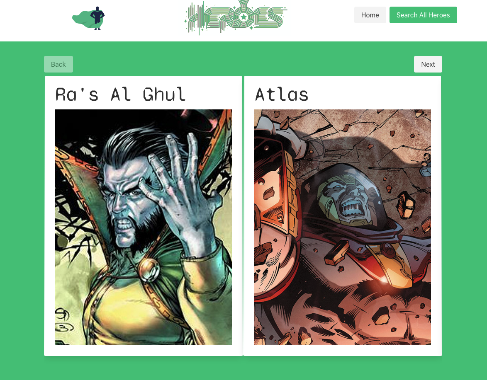
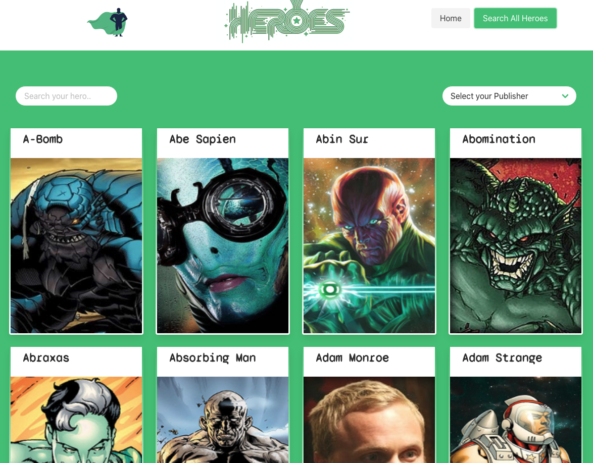
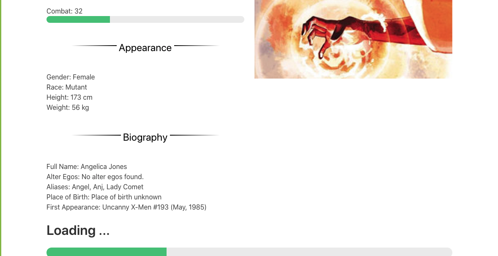
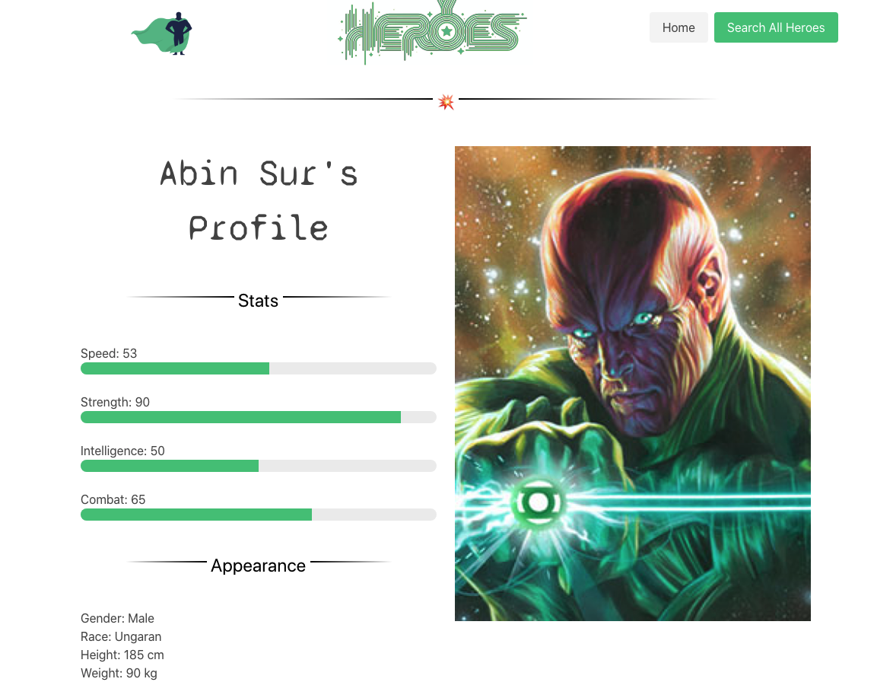

###  

### General Assembly, Software Engineering Immersive

# Super Search
 

## Overview

This is the second project of the software engineering immersive course at GA London. The assignment was to create a react-based web app to be rendered in the browser, using using react along with APIs. The project was to be completed **in pairs** within **48 hours**.


You can launch the app on GitHub pages [here](https://dec1992.github.io/project-2/), or find the GitHub repo [here](https://github.com/dec1992/project-2).

## Brief

Create an app that:

- **Consumes a public API**
- **Has several components**
- **Includes a router**
- **Have semantically clean HTML**
- **Be deployed online**

## Technologies used

- HTML
- CSS
- JavaScript (ES6)
- React
- Webpack
- Bulma
- APIs ([Superhero API](https://superheroapi.com/), [Comicvine](https://comicvine.gamespot.com/api/))
- Routers
- Axios
- Pure React Carousel
- Git and GitHub
- Adobe Photoshop
- Google Fonts

## Approach

### Site Layout

- We used react router to be able to link between different pages on the site, and then render the required components to the page.

- We included a global navbar on all of the pages, using links to allow navigation around the site.

  ```js
  const App = () => (
  <BrowserRouter>
    <Navbar />
    <Switch>
      <Route exact path="/" component={Home}/>
      <Route exact path="/Heroes" component={Heroes}/>
      <Route exact path="/Heroes/:heroId" component={Hero}/>
    </Switch>
  </BrowserRouter>)
	```

### API Integration
- We used Axios to fetch data from the superhero API.

```js
  useEffect(() => {
    axios.get('https://akabab.github.io/superhero-api/api/all.json')
      .then(resp => {
        updatesHeroes(resp.data)
      })
```

- We mapped the data from the returned array in order to generate a card for each hero. The cards were then displayed in a responsive grid on the page.

```js
<div className="columns is-multiline is-mobile">
        {filterHeroes().map((hero, index) => {
          return <div
            className="column is-one-quarter-desktop is-half-tablet is-half-mobile"
            key={index}
          >

            <Link to={`/heroes/${hero.id}`}>
              <div className="card">
                <div className="card-content">
                  <div className="media">
                    <div className="media-content">
                      <h2 className="title is-4">{hero.name}</h2>
                    </div>
                  </div>
                </div>
                <div className="card-image">
                  <figure className="image is-3by4">
                    
                  </figure>
                </div>
              </div>

            </Link>


          </div>
        })}
      </div>
```

- We later combined this fetch with a fetch from a second API in order to return information about the first comic each hero appeared in.
- We used async functions and await in order to manage the asynchronous nature of these API fetches.

```js
useEffect(() => {
    async function fetchData() {
      const { data } = await axios.get(`https://cors-anywhere.herokuapp.com/https://comicvine.gamespot.com/api/search/?api_key=44be91bd8aa144e2b56b0202f49e378ccc9f6ff8&format=json&query=${heroName}&limit`)
      updateComic(data)
      const { data: firstIssue } = await axios.get(`https://cors-anywhere.herokuapp.com/https://comicvine.gamespot.com/api/issue/4000-${data.results[0].first_appeared_in_issue.id}/?api_key=44be91bd8aa144e2b56b0202f49e378ccc9f6ff8&format=json`)
      updateUrl(firstIssue)
    }
    fetchData()
  }, [])
```

### Home Page Carousel
- We installed a carousel component in order to display images of some of the heroes on our homepage.
- We adjusted parameters of the component in order to format the information from our fetch into cards, to display multiple cards per screen, and to allow the carousel to rotate automatically.
- The carousel initially displayed the heroes in the original alphabetical order of the fetched array. We wrote a function with javascript loginc in order to create a new array with a randomised order.

 ```js
 <section className="hero is-medium-with-navbar is-success">
      <div className="hero-body">
        <div className="container">
          <CarouselProvider
            naturalSlideWidth={100}
            naturalSlideHeight={150}
            interval={5000}
            isPlaying={true}
            totalSlides={1000}
            visibleSlides={2}
          >
            <nav className="level levelButton">
              <div className="level-left">
                <ButtonBack className="level-item button is-light">Back</ButtonBack>
              </div>
              <div className="level-right">
                <ButtonNext className="level-item button is-light">Next</ButtonNext>
              </div>
            </nav>
            <Slider>

              {shuffle().map((hero, index) => {
                return <section key={index}>
                  <Slide>

                    <Link to={`/heroes/${hero.id}`}>


                      <div className="card">
                        <div className="card-content">
                          <div>
                            <h1 className="is-title is-size-1">{hero.name}</h1>
                            <figure className="image is-3by4">
                              </img>
                            </figure>
                          </div>
                        </div>
                      </div>
                    </Link>
                  </Slide>
                </section>
              })}
            </Slider>
          </CarouselProvider>
        </div>
      </div>
    </section>
 ```


### Heroes Page Search and Filter
- We used onChange on an input and a select field on our page in order to allow the user to search for a hero, and to filter the heroes by publisher.
- The search function and the filter was designed to be able to be used in conjunction with one another.
- We wrote functions to filter the data from our array based on the selected field and the input and render the results on the page.
  
```js
function filterHeroes() {
    const filteredHeroes = heroes.filter(hero => {
      const name = hero.name.toLowerCase()
      const filterText = searchText.toLocaleLowerCase()
      return name.includes(filterText)
        && (heroFilter === 'Select your Publisher' || hero.biography.publisher === heroFilter)
    })
    return filteredHeroes
  }
  function getPublishers() {
    const mappedHeroes = heroes.map((hero => hero.biography.publisher))
    const publisherList = new Set(mappedHeroes)
    const arrayPublishers = Array.from(publisherList)
    return arrayPublishers
  }
```


### Loading Bars
- We used if statements in various places throughout the app in order to display a loading bar while data was being fetched from the API in order to allow the page to render without error.
- we used the indeterminate progress bars from Bulma to create moving loading bars to indicate progress.
	
```js
if (!heroes[1]) {
    return <div className="section">
      <div className="container">
        <div className="title">
          Loading ...
        </div>
        <progress className="progress is-large is-success" max="100">60%</progress>
      </div>
    </div>
  }
```


- We also used the progress bars from Bulma in order to display each hero's stats based on information from our API fetch.

```js
<p>Speed: {hero.powerstats.speed}</p>
            <progress className="progress  is-success" value={hero.powerstats.speed} max="100">{hero.powerstats.speed}</progress>

            <p>Strength: {hero.powerstats.strength}</p>
            <progress className="progress  is-success" value={hero.powerstats.strength} max="100">{hero.powerstats.strength}</progress>

            <p>Intelligence: {hero.powerstats.intelligence}</p>
            <progress className="progress  is-success" value={hero.powerstats.intelligence} max="100">{hero.powerstats.intelligence}</progress>

            <p>Combat: {hero.powerstats.combat}</p>
            <progress className="progress  is-success" value={hero.powerstats.combat} max="100">{hero.powerstats.combat}</progress>
```



## Styling

- The majority of the styling and responsiveness for the app was handled using Bulma.
- We used CSS to overwrite some of the Bulma stylings for customisation.
- We also used media queries in some places to adjust the responsiveness of the site.


## Screenshots


## Potential future features

- More filters
- Links to more information about the heroes and their comics/movies
- Navigation within the indivivual hero pages to view or compare other heroes.


